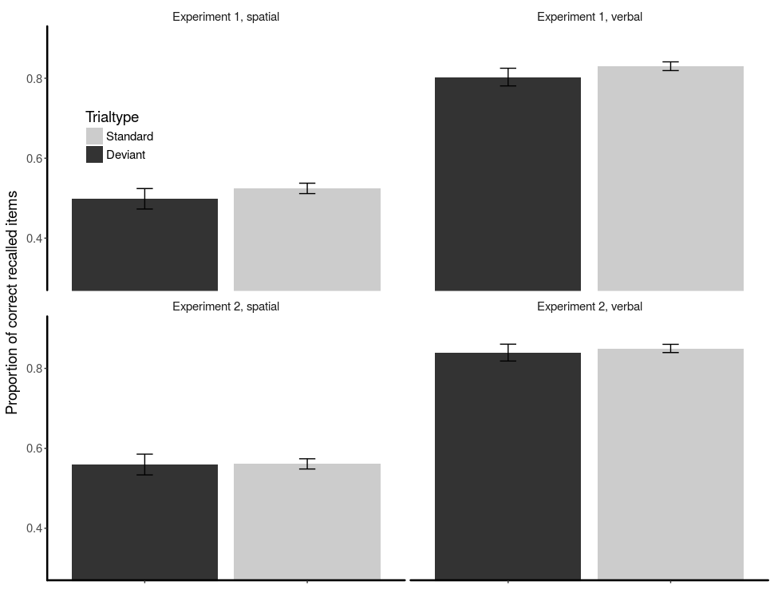

# Repository for the poster presented at *rethinking the senses* spring school 2017

This repository holds the LaTeX (beamer) file, along with the data for the analysis, creating the poster. 

## Domain-generality or domain-specificity of the short-term memory: insights from a multisensory distraction paradigm*

Erik Marsjaa, John E. Marshb,c, Patrik Hanssona,
Gregory Neelya, & Jessica K. Ljungberga,d

aDepartment of Psychology, Umeå University, Sweden.
bDepartment of Building, Energy and Environmental Engineering,
University of Gävle, Sweden.\
cSchool of Psychology, University of Central Lancashire, Preston,
UK. dSchool of Psychology, Cardiff University, UK.

**Contact:** Erik Marsja (erik.marsja [at] umu.se or erik [at] marsja.se)

### Introduction 

Unexpected changes (e.g., deviant stimuli) in
a repetitive stream of standard stimuli are known to prolong responses
in visual categorization tasks (e.g., Parmentier, 2014) and disrupt
short-term memory (e.g., Hughes et al., 2007). While this deviation effect has
been studied extensively using sounds, far less focus has been on
unexpected changes in irrelevant bimodal stimuli. A further issue is
whether a spatial change in either the tactile, auditory or in both
modalities simultaneously, affects verbal and spatial short-term memory
similarly.

### Aim

Examine whether the short-term memory (STM) is
domain-specific by using deviant spatial changes in bimodal (auditory
and vibrotactile) and uni-modal (vibrotactile) to-be-ignored (TBI)
sequences.

### Methods 
Across two experiments subjects performed (47 and 50, in Experiment 1 and 2, respectively) verbal and spatial STM tasks while being exposed to TBI sequences.\

In the verbal task, 7 digits were taken randomly without replacement
from the digit set 1-9. In the spatial task, 7 items (dots) were taken
randomly from a 5 x 5 matrix.\
The vibrotactile sequences were comprised of 10 repetitions of a
vibration of 240Hz, and the amplitude of 1.8g (peak-to-peak), delivered
using coin vibration motors. The auditory sequences were comprised of 10
repetitions of a 600Hz tone, delivered through sound attenuated
headphones. See Figure 1 for a schematic overview of the experiments.\
In Experiment 1, TBI sequence consisted of both auditory and
vibrotactile sequences (simultaneously presented) whereas only
vibrations were used in Experiment 2. The TBI sequences changed side of
the body on 20% of the trials (spatial deviant trials). The task was to
remember the order of the TBR items.

### Results & Discussion
The proportion of correctly recalled items was analyzed using a 2 (Task: Spatial, Verbal) x 2 (Trialtype: Standard, Deviant).

*Experiment 1.* Subjects performance were significantly worse in the
spatial task. Performance in the spatial deviant trials was worse
compared to standard trials (See Table 1).

<table border=1>
<caption align="top"> Results Experiment 1 </caption>
<tr> <th> Effect </th> <th> DF </th> <th> *MSE* </th> <th> *F* </th> <th> partial omega squared </th> <th> *p* </th>  </tr>
  <tr> <td> Task </td> <td> 1, 46 </td> <td> 0.03 </td> <td> 165.00 *** </td> <td> .78 </td> <td> <.0001 </td> </tr>
  <tr> <td> Trialtype </td> <td> 1, 46 </td> <td> 0.00 </td> <td> 13.19 *** </td> <td> .22 </td> <td> .0007 </td> </tr>
  <tr> <td> Task:Trialtype </td> <td> 1, 46 </td> <td> 0.00 </td> <td> 0.39 </td> <td> -0.013 </td> <td> .54 </td> </tr>
   </table>

To further examine the impact of the spatial deviant, one-way ANOVAs for
each tasks were conducted. It revealed that the spatial deviant affected
both tasks negatively (see Figure 1), meaning that a spatial change can
distract both spatial and verbal STM.

*Experiment 2.* Performance was significantly worse in the spatial task
but there was no evidence that the spatial change (i.e., spatial
deviant) in the vibrotactile TBI sequence affected performance. See
Table 2.

<table border=1>
<caption align="top"> Results Experiment 2 </caption>
<tr> <th> Effect </th> <th> DF </th> <th> *MSE* </th> <th> *F* </th> <th> partial omega squared </th> <th> *p* </th>  </tr>
  <tr> <td> Task </td> <td> 1, 49 </td> <td> 0.02 </td> <td> 169.37 *** </td> <td> .50 </td> <td> <.0001 </td> </tr>
  <tr> <td> Trialtype </td> <td> 1, 49 </td> <td> 0.00 </td> <td> 0.68 </td> <td> .0005 </td> <td> .41 </td> </tr>
  <tr> <td> Task:Trialtype </td> <td> 1, 49 </td> <td> 0.00 </td> <td> 0.11 </td> <td> -0.018 </td> <td> .74 </td> </tr>
   </table>
   

### Conclusions

-   An unexpected spatial change in a bimodal TBI sequence affects both
    verbal and spatial short-term memory whereas a spatial change in a
    vibrotactile TBI sequence does not.

-   Our results from Experiment 1 (see also Vachon et al., 2016) questions the
    assumption of domain-specificity but is in line with Cowan’s model
    (e.g., 1995) and multisensory perspectives (e.g., Quak et al., 2015).

-   However, our results from Experiment 2 may be troublesome for
    multisensory perspectives of STM/WM.

### References

Cowan, N. (1995). Attention and memory: an integrated framework. Oxford Psychology.

Hughes, R. W., Vachon, F., & Jones, D. M. (2007). Disruption of short-term memory by changing and deviant sounds: support for a duplex-mechanism account of auditory distraction. Journal of Experimental Psychology. Learning, Memory, and Cognition, 33(6), 1050–61. http://doi.org/10.1037/0278-7393.33.6.1050

Parmentier, F. B. R. (2014). The cognitive determinants of behavioral distraction by deviant auditory stimuli: A review. Psychological Research, 78(3), 321–338. http://doi.org/10.1007/s00426-013-0534-4

Vachon, F., Labonté, K., & Marsh, J. E. (2016). Attentional Capture by Deviant Sounds: A Noncontingent Form of Auditory Distraction? Journal of Experimental Psychology: Learning, Memory, and Cognition, (September). http://doi.org/10.1037/xlm0000330

Quak, M., London, R. E., & Talsma, D. (2015). A multisensory perspective of working memory. Frontiers in Human Neuroscience, 9(April), 1–11. http://doi.org/10.3389/fnhum.2015.00197
